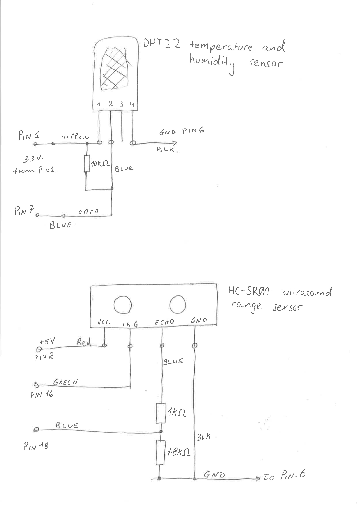

# cognicity-floodsensor
IoT water depth, temperature and humidity sensor code

# Installation
First clone this repository and install dependencies:
```shell
git clone https://github.com/smart-facility/cognicity-floodsensor
cd cognicity-floodsensor
```

## Database Schema
Schema is design for PostgreSQL with the PostGIS extension.

Create the schema by running `schema/cognicity_floodsensor_pg_schema.sql` in target database.

## Lambda side
```shell
cd lambda
npm install
```
Copy [lambda/sample_config.js](lambda/sample_config.js) to a file called `config` in the `lambda` subdirectory, and edit it to replace the sample PostgreSQL config string with your actual string.
Then in the lambda subdirectory
```shell
npm install
zip -r -9 ../lambda.zip *
```
and upload the lambda.zip file to AWS lambda.

## Device-side
```shell
cd device
npm install
```

Set up a device and associated certificate in AWS IoT (CLI or console) and then copy the private key (as *private.pem.key*) and certificate (as *certificate.pem.crt*) under *awsCerts/*.

Set the configuration options as described in [device/config.js](device/config.js)

Run this (note it needs to be run as root to access the GPIO memory):
```shell
sudo node device.js
```
Ctrl-C to quit.

# Units
All distances are stored as centimetres (cm), temperature in °C, and humidity as %.

# Circuit
The circuit schematic we use with this software (included hard-coded pin numbers in set up of DHT and HC-SR04 libraries) is as follows:

